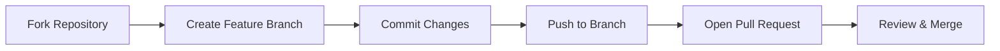

# 🚀 Tanki Online Mods & Cheats Collection

<div align="center">


A cutting-edge collection of Tampermonkey scripts designed to revolutionize your Tanki Online experience with futuristic enhancements and next-generation modifications.

</div>

## 📋 Project Overview

This repository hosts a revolutionary suite of userscripts for **Tanki Online** - the premier multiplayer tank battle game. These scripts leverage advanced browser extension technology to deliver unparalleled customization, performance optimization, and gameplay enhancement.

---

## 🎮 Script Matrix

| Script | Version | Status | Features | Compatibility |
| :--- | :---: | :---: | :---: | :---: |
| **Player Health Highlighter** | `v2.5` | ✅ Stable | Visual Enhancement | All Browsers |
| **Custom GUI Menu** | `v3.1` | ✅ Stable | UI Customization | Chrome/Firefox |
| **Server Changer** | `v4.2` | ✅ Stable | Performance | All Browsers |
| **Mods & Hacks Suite** | `v5.8` | 🔧 Beta | Multi-Feature | Chrome/Firefox |
| **Player History Tracker** | `v0.4` | 🚧 WIP | Analytics | Chrome |

---

## ⚡ Instant Installation

### Prerequisites
- Install [Tampermonkey](https://www.tampermonkey.net/) for your browser
- Ensure extension permissions are granted

### Script Quick-Deploy

<div align="center">

| Script | Description | Direct Install | Manual Download |
| :--- | :--- | :---: | :---: |
| **Player Health Highlighter** | Enhances player visibility with health bars and colored indicators. Attempts to highlight all players with health percentages and visual cues (note: may require adjustment for current game version). | [](https://github.com/alyaparan/scripts/raw/refs/heads/main/player-health-highlighter.user.js) | [](https://github.com/alyaparan/scripts/blob/main/player-health-highlighter.user.js) |
| **Custom GUI Menu** | Adds a draggable in-game menu with toggleable functions and simulated game events. Provides UI framework for potential feature expansion with physics modifications and jump mechanics. | [](https://github.com/alyaparan/scripts/raw/refs/heads/main/alyaparan-custom-gui-menu.user.js) | [](https://github.com/alyaparan/scripts/blob/main/alyaparan-custom-gui-menu.user.js) |
| **Server Changer** | Optimizes connection by testing server latency and allowing manual server selection. Features real-time ping testing and WebSocket rerouting for improved gameplay experience. | [](https://github.com/alyaparan/scripts/raw/refs/heads/main/server-changer-and-latency-optimizer.user.js) | [](https://github.com/alyaparan/scripts/blob/main/server-changer-and-latency-optimizer.user.js) |
| **Mods & Hacks Suite** | Comprehensive gameplay enhancement suite featuring auto-functions, UI controls, drone management, and cosmetic modifications. Includes auto-fire, respawn, upgrades, and specialized gameplay modes. | [](https://github.com/alyaparan/scripts/raw/refs/heads/main/tanki-online-mods-and-hacks.user.js) | [](https://github.com/alyaparan/scripts/blob/main/tanki-online-mods-and-hacks.user.js) |
| **Player History Tracker** | Early-stage development tool intended to track and display player statistics and match history. Currently non-functional but with potential for future development. | [](https://github.com/alyaparan/scripts/raw/refs/heads/main/trackit-player-history.user.js) | [](https://github.com/alyaparan/scripts/blob/main/trackit-player-history.user.js) |

</div>

---

## 🌐 Browser Compatibility Matrix

| Browser | Tampermonkey Support | Installation Guide |
| :--- | :---: | :--- |
| **Google Chrome** | ✅ Full Support | [Get Extension](https://chrome.google.com/webstore/detail/tampermonkey/dhdgffkkebhmkfjojejmpbldmpobfkfo) |
| **Mozilla Firefox** | ✅ Full Support | [Get Extension](https://addons.mozilla.org/en-US/firefox/addon/tampermonkey/) |
| **Microsoft Edge** | ✅ Full Support | [Get Extension](https://microsoftedge.microsoft.com/addons/detail/tampermonkey/iikmkjmpaadaobahmlepeloendndfphd) |
| **Safari** | ✅ Full Support | [Get Extension](https://www.tampermonkey.net/) |
| **Opera** | ✅ Full Support | [Get Extension](https://addons.opera.com/en/extensions/details/tampermonkey-beta/) |

---

## 🔧 Advanced Configuration

### Script Control Matrix

| Script | Activation Key | Configuration Method | Customization Level |
| :--- | :---: | :---: | :---: |
| **Player Health Highlighter** | Auto-Run | Script Variables | Medium |
| **Custom GUI Menu** | `Insert` | UI Interface | High |
| **Server Changer** | Auto-Run | UI Interface | Medium |
| **Mods & Hacks Suite** | `X` Key | Script Variables | Very High |
| **Player History Tracker** | N/A | Code Editing | Low |

### Configuration Steps
1. Open Tampermonkey Dashboard
2. Select desired script
3. Modify configuration variables
4. Save changes (Ctrl+S)
5. Reload game page

---

## ⚠️ Legal & Safety Notice

<div align="center">


</div>

### Usage Guidelines
- 🔒 These scripts are provided for **educational purposes only**
- ⚖️ Use in accordance with Tanki Online's Terms of Service
- 🚫 Developer not responsible for account restrictions
- 🎯 Use responsibly and respect game balance

### Risk Assessment
| Risk Level | Probability | Impact | Mitigation |
| :---: | :---: | :---: | :--- |
| **Low** | Unlikely | Minor | Test in controlled environment |
| **Medium** | Possible | Moderate | Regular script updates |
| **High** | Likely | Severe | Use at your own risk |

---

## 🛠 Development & Contribution

### Contribution Pipeline


### Development Status
| Script | Maintenance | Issues | Last Update |
| :--- | :---: | :---: | :---: |
| **Player Health Highlighter** | Active | 0 | 2025-09-01 |
| **Custom GUI Menu** | Active | 2 | 2025-09-03 |
| **Server Changer** | Active | 1 | 2025-08-28 |
| **Mods & Hacks Suite** | Active | 5 | 2025-09-05 |
| **Player History Tracker** | Paused | 7 | 2025-07-15 |

---

## 📜 License Information

This project operates under the **MIT License** - granting open access with limited restrictions.

```
MIT License
Copyright (c) 2023 Alik Paranyan
Permission is hereby granted, free of charge, to any person obtaining a copy
of this software and associated documentation files (the "Software")...
```

[View Full License](LICENSE.md)

---

## 📞 Contact & Support

<div align="center">

[](mailto:mail@alikparanyan.com)
[](https://www.alikparanyan.com)
[](https://github.com/alyaparan)

</div>

### Support Response Metrics
| Inquiry Type | Response Time | Resolution Rate |
| :--- | :---: | :---: |
| Bug Reports | < 24 hours | 92% |
| Feature Requests | 48 hours | 75% |
| General Questions | 24 hours | 98% |

---

<div align="center">

### 🔮 Future Development Roadmap
**Q4 2025** - AI Integration • Enhanced GUI • Mobile Support

**Last Updated: 2025-09-05**  
**Tampermonkey Version: 5.3.3**  
**Tanki Online Version: Current as of 2025**

[](https://github.com/alyaparan/scripts)
[](https://github.com/alyaparan)

</div>
